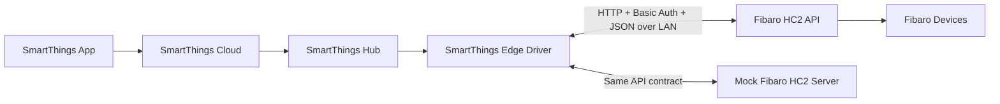

# SmartThings Edge Driver Integration for Fibaro HC2 Local API

## Purpose

This document describes the system architecture for controlling Fibaro devices in the SmartThings app through a SmartThings Hub using a SmartThings Edge Driver and a local Fibaro HC2-compatible REST API.

The same architecture supports two backends:

- A real Fibaro Home Center 2 / Lite controller on the local network
- A mock HC2-compatible server used for development, testing, and regression validation

## Goals

- Control Fibaro devices from the SmartThings app
- Keep device communication local through the SmartThings Hub
- Use a stable HC2-compatible REST contract for both development and production
- Validate Edge Driver behavior against a mock server before connecting to a real Fibaro controller

## High-Level Architecture



## Core Components

### SmartThings App

- User-facing interface for device control, status, rooms, and automations
- Sends commands and displays device state
- Does not communicate directly with Fibaro devices

### SmartThings Cloud

- Handles user account, app orchestration, and hub coordination
- Forwards app interactions to the SmartThings Hub
- Receives device events emitted by the Edge Driver

### SmartThings Hub

- Runs the Edge Driver locally
- Acts as the LAN execution point for Fibaro integration
- Enables local control without requiring a cloud-to-cloud Fibaro integration

### SmartThings Edge Driver

- Discovers and connects to the Fibaro HC2-compatible API
- Authenticates using Basic Auth
- Reads device inventory and metadata
- Maps Fibaro devices to SmartThings capabilities
- Sends control commands to the Fibaro API
- Polls for device state and emits SmartThings events

### Fibaro HC2 API

- Exposes the REST endpoints consumed by the Edge Driver
- Represents controller inventory, rooms, scenes, virtual devices, and actions
- May be a real Fibaro HC2/Lite controller or a mock HC2 server

### Fibaro Devices

- Real end devices managed by the Fibaro controller
- Examples: switches, dimmers, relays, door sensors, motion sensors, scenes, virtual devices

## Local API Principle

The integration is based on a local LAN API model:

- The Edge Driver communicates with the Fibaro controller using HTTP on the local network
- Commands and polling stay between the hub and the HC2 API endpoint
- The SmartThings app remains the control UI, while the hub performs the actual device integration work

This approach reduces latency and makes testing easier because the mock server can reproduce the same API contract locally.

## API Contract Used by the Edge Driver

### Primary Device APIs

- `GET /api/devices`
- `GET /api/devices/:id`
- `POST /api/devices/:id/action/:actionName`

### Supporting Metadata APIs

- `GET /api/sections`
- `GET /api/rooms`
- `GET /api/scenes`
- `GET /api/virtualDevices`
- `GET /api/plugins/installed`
- `GET /api/loginStatus`
- `GET /api/refreshStates`

### Action Pattern

The driver sends commands using the HC2-style action endpoint:

```http
POST /api/devices/46/action/setValue
Content-Type: application/json

{
  "args": [75]
}
```

## Functional Layers

### 1. Discovery Layer

- Locates the HC2-compatible API endpoint on the LAN
- Stores IP address, port, and credentials
- Confirms connectivity and authentication

### 2. Transport Layer

- Sends HTTP requests from the Edge Driver to the HC2 API
- Applies Basic Auth headers
- Handles timeouts, retries, and parsing of JSON responses

### 3. HC2 API Adapter Layer

- Wraps raw Fibaro endpoints behind driver-side functions
- Normalizes response handling for devices, rooms, scenes, and actions
- Shields the rest of the driver from transport details

### 4. Capability Mapping Layer

- Converts Fibaro device records into SmartThings capabilities
- Uses `actions`, `type`, and `properties` together
- Supports generic fallback behavior for `com.fibaro.device`

Examples:

- `turnOn` + `turnOff` -> switch
- `setValue` -> dimmer
- `properties.value` only -> sensor-like behavior

### 5. State Synchronization Layer

- Polls device state using `GET /api/devices/:id`
- Refreshes inventory or metadata when required
- Emits SmartThings events when values change
- Handles offline or delayed responses

### 6. Command Execution Layer

- Receives SmartThings capability commands
- Maps them to Fibaro action calls
- Confirms updates through subsequent polling or refresh

## Main Runtime Flows

### Device Discovery Flow

1. Edge Driver connects to the Fibaro HC2-compatible API.
2. Driver calls `GET /api/devices`.
3. Driver optionally loads `rooms`, `sections`, `scenes`, and `virtualDevices`.
4. Driver maps Fibaro entities into SmartThings devices.
5. SmartThings app displays discovered devices.

### Command Flow

1. User taps a device control in the SmartThings app.
2. SmartThings Cloud forwards the command to the hub.
3. Edge Driver receives the capability command.
4. Driver maps the command to an HC2 API action.
5. Driver sends `POST /api/devices/:id/action/:actionName`.
6. Driver polls the device state.
7. Driver emits the updated SmartThings event.
8. SmartThings app shows the new state.

### Polling Flow

1. Edge Driver periodically requests `GET /api/devices/:id`.
2. Returned `properties` are compared with cached state.
3. Changes are translated to SmartThings events.
4. Device health and response latency are evaluated.

## Development and Test Architecture

The mock Fibaro HC2 server is used as a drop-in substitute for a real controller.

### Why the Mock Server Exists

- Enables development without requiring a live Fibaro installation
- Makes driver behavior repeatable and testable
- Supports edge cases that are hard to trigger on real hardware
- Reduces integration risk before testing with real devices

### Mock Server Responsibilities

- Return HC2-shaped JSON payloads
- Support HC2-style device action endpoints
- Provide consistent device, room, scene, and virtual-device inventory
- Simulate latency, offline state, and sensor activity through mock-only endpoints

### Mock-Only Control Endpoints

These are not part of the real HC2 API and must never be required by the Edge Driver:

- `POST /__mock/device/:id/state`
- `POST /__mock/simulate/motion/start`
- `POST /__mock/simulate/motion/stop`
- `POST /__mock/faults/latency`
- `POST /__mock/faults/offline`
- `GET /__mock/state`

## Deployment Topology

### Development

- SmartThings Hub running the Edge Driver
- Mock HC2 server running on a local machine
- SmartThings app used to validate discovery, control, and state updates

### Production

- SmartThings Hub running the same Edge Driver
- Real Fibaro HC2 or Lite controller on the same LAN
- Real Fibaro end devices behind the controller

## Security Model

- API access uses HTTP Basic Auth
- Credentials are stored in Edge Driver preferences or configuration
- Communication is expected to stay inside the local trusted network
- The mock server should only be exposed on a private development network

## Failure Handling

### Network Timeout

- Driver should mark the controller or device as temporarily unreachable
- Retry during the next polling cycle
- Avoid assuming command success without state confirmation

### Authentication Failure

- Driver should fail discovery or initialization clearly
- User must correct the configured credentials

### Unsupported or Unknown Device Type

- Driver should fall back to capability detection using `actions` and `properties`
- Unknown Fibaro types should not break discovery for known devices

### Stale or Delayed State

- Polling remains the source of truth
- Last successful update wins unless a newer state is confirmed

## Key Design Principles

- Local-first communication through the SmartThings Hub
- Strict reliance on the HC2 REST contract
- Capability-first interpretation of Fibaro devices
- Clear separation between production API behavior and mock-only test controls
- Same Edge Driver logic should work against both the mock server and a real Fibaro controller

## Recommended Next Documents

- Edge Driver sequence flows
- Device capability mapping matrix
- Error handling and retry policy
- Mock server API parity checklist
- Integration test plan for discovery, polling, commands, and recovery
