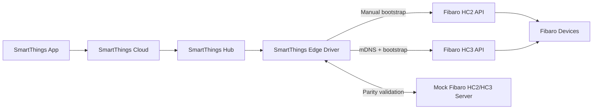

# SmartThings Edge Driver Integration for Fibaro HC2 and HC3 Local API

## Purpose

This document describes the current architecture for controlling Fibaro devices in the SmartThings app through a SmartThings Hub using a SmartThings Edge Driver and local Fibaro HC2 or HC3 REST APIs.

The same driver package supports two controller families:

- HC2 style controllers through manual onboarding
- HC3 style controllers through mDNS discovery plus bootstrap validation

## Goals

- Control Fibaro devices from the SmartThings app
- Keep device communication local through the SmartThings Hub
- Use a stable Fibaro local REST contract across both controller families
- Discover HC3 controllers through mDNS on the LAN
- Validate Edge Driver behavior against the mock server before connecting to a real Fibaro controller

## High-Level Architecture



## Core Components

### SmartThings App

- User-facing interface for device control, status, rooms, and automations
- Sends commands and displays device state
- Does not communicate directly with Fibaro devices

### SmartThings Cloud

- Handles user account, app orchestration, and hub coordination
- Forwards app interactions to the SmartThings Hub
- Receives device events emitted by the Edge Driver

### SmartThings Hub

- Runs the Edge Driver locally
- Acts as the LAN execution point for Fibaro integration
- Enables local control without requiring a cloud-to-cloud Fibaro integration

### SmartThings Edge Driver

- Maintains one package for HC2 and HC3
- Uses manual placeholder onboarding for HC2
- Uses required mDNS discovery for HC3
- Bootstraps controller identity through `loginStatus` and `settings/info`
- Maps normalized Fibaro devices to SmartThings capabilities
- Sends local device commands over LAN
- Uses inventory sync plus `refreshStates` incremental polling

### Fibaro Controller APIs

- Expose the REST endpoints consumed by the Edge Driver
- Represent controller inventory, rooms, scenes, virtual devices, plugins, and actions
- May be a real Fibaro HC2, HCL, HC3, HC3L, Yubii Home, or a mock compatibility server

### Fibaro Devices

- Real end devices managed by the Fibaro controller
- Examples: switches, dimmers, relays, door sensors, motion sensors, scenes, virtual devices

## Local API Principle

The integration is based on a local LAN API model:

- The Edge Driver communicates with the Fibaro controller using local HTTP or HTTPS on the LAN
- Commands and polling stay between the hub and the HC2 API endpoint
- The SmartThings app remains the control UI, while the hub performs the actual device integration work

This approach reduces latency and makes testing easier because the mock server can reproduce the same API contract locally.

## API Contract Used by the Edge Driver

### Bootstrap APIs

- `GET /api/loginStatus`
- `GET /api/settings/info`

### Primary Device APIs

- `GET /api/devices`
- `GET /api/devices/:id`
- `POST /api/devices/:id/action/:actionName`

### Supporting Metadata APIs

- `GET /api/sections`
- `GET /api/rooms`
- `GET /api/scenes`
- `GET /api/virtualDevices`
- `GET /api/plugins/installed`
- `GET /api/refreshStates`

### Scene APIs By Controller Family

- HC2: `POST /api/scenes/:id/action/start`
- HC2: `POST /api/scenes/:id/action/stop`
- HC3: `POST /api/scenes/:id/execute`
- HC3: `POST /api/scenes/:id/kill`

### Action Pattern

The driver sends commands using the HC2-style action endpoint:

```http
POST /api/devices/46/action/setValue
Content-Type: application/json

{
  "args": [75]
}
```

## Functional Layers

### 1. Discovery Layer

- Creates one manual HC2 bridge placeholder
- Scans `_http._tcp.local` for HC3 controllers through `st.mdns`
- Extracts host, port, `platform`, `serialNumber`, and related TXT data
- Creates or updates HC3 bridge devices from the discovered serial number

### 2. Transport Layer

- Sends HTTP requests from the Edge Driver to the HC2 API
- Applies Basic Auth headers
- Handles timeouts, retries, and parsing of JSON responses

### 3. Bootstrap and Adapter Layer

- Reads `loginStatus` and `settings/info` before inventory sync
- Determines controller family from `platform` and `serialNumber`
- Selects the HC2 or HC3 adapter path
- Normalizes response handling for devices, scenes, and actions

### 4. Capability Mapping Layer

- Converts Fibaro device records into SmartThings capabilities
- Uses `actions`, `type`, and `properties` together
- Supports generic fallback behavior for `com.fibaro.device`

Examples:

- `turnOn` + `turnOff` -> switch
- `setValue` -> dimmer
- `properties.value` only -> sensor-like behavior

### 5. State Synchronization Layer

- Performs full inventory sync on startup and reconciliation passes
- Polls device state using `GET /api/devices/:id`
- Tracks incremental bridge changes with `GET /api/refreshStates?last=<cursor>`
- Refreshes only touched child devices when the change feed reports updates
- Emits SmartThings events when values change
- Handles offline or delayed responses

### 6. Command Execution Layer

- Receives SmartThings capability commands
- Maps them to Fibaro action calls
- Confirms updates through subsequent polling or refresh

## Main Runtime Flows

### HC2 Discovery Flow

1. The driver creates a manual HC2 bridge placeholder.
2. The user enters host and credentials.
3. The driver calls `GET /api/loginStatus`.
4. The driver calls `GET /api/settings/info`.
5. The driver confirms the HC2 family.
6. The driver calls `GET /api/devices`.
7. The driver creates SmartThings child devices for supported end devices.

### HC3 Discovery Flow

1. The driver scans `_http._tcp.local` using mDNS.
2. The driver resolves host, port, and TXT data.
3. The driver creates or updates a bridge keyed by discovered serial number.
4. The driver calls `GET /api/loginStatus`.
5. The driver calls `GET /api/settings/info`.
6. The driver confirms the HC3 family.
7. The driver calls `GET /api/devices`.
8. The driver creates SmartThings child devices for supported end devices.

### Command Flow

1. User taps a device control in the SmartThings app.
2. SmartThings Cloud forwards the command to the hub.
3. Edge Driver receives the capability command.
4. Driver maps the command to an HC2 API action.
5. Driver sends `POST /api/devices/:id/action/:actionName`.
6. Driver polls the device state.
7. Driver emits the updated SmartThings event.
8. SmartThings app shows the new state.

### Incremental Polling Flow

1. Edge Driver stores the last `refreshStates` cursor on the bridge.
2. Periodic bridge polls call `GET /api/refreshStates?last=<cursor>`.
3. Changed device IDs trigger targeted `GET /api/devices/:id` refreshes.
4. Unknown change IDs or cursor failures fall back to a full inventory sync.

## Development and Test Architecture

The mock Fibaro server is used as a drop-in substitute for a real controller.

### Why the Mock Server Exists

- Enables development without requiring a live Fibaro installation
- Makes driver behavior repeatable and testable
- Supports edge cases that are hard to trigger on real hardware
- Reduces integration risk before testing with real devices

### Mock Server Responsibilities

- Return HC2- and HC3-shaped JSON payloads
- Support controller-specific scene routes
- Advertise HC3-style mDNS records for discovery testing
- Provide consistent device, room, scene, and virtual-device inventory
- Simulate latency, offline state, and sensor activity through mock-only endpoints

### Mock-Only Control Endpoints

These are not part of the real HC2 API and must never be required by the Edge Driver:

- `POST /__mock/device/:id/state`
- `POST /__mock/simulate/motion/start`
- `POST /__mock/simulate/motion/stop`
- `POST /__mock/faults/latency`
- `POST /__mock/faults/offline`
- `GET /__mock/state`

## Deployment Topology

### Development

- SmartThings Hub running the Edge Driver
- Mock HC2/HC3 server running on a local machine
- SmartThings app used to validate discovery, control, and state updates

### Production

- SmartThings Hub running the same Edge Driver
- Real Fibaro HC2, HCL, HC3, HC3L, or compatible controller on the same LAN
- Real Fibaro end devices behind the controller

## Security Model

- API access uses HTTP Basic Auth
- Credentials are stored in Edge Driver preferences or configuration
- Communication is expected to stay inside the local trusted network
- The mock server should only be exposed on a private development network

## Failure Handling

### Network Timeout

- Driver should mark the controller or device as temporarily unreachable
- Retry during the next polling cycle
- Avoid assuming command success without state confirmation

### Authentication Failure

- Driver should fail bootstrap or initialization clearly
- User must correct the configured credentials

### Unsupported or Unknown Device Type

- Driver should use capability detection from `actions`, `type`, and normalized properties
- Controller, user, plugin, and virtual-device noise should be filtered before child creation
- Unknown Fibaro types should not break discovery for known devices

### Stale or Delayed State

- `refreshStates` is the preferred incremental feed
- Full inventory sync remains the reconciliation source of truth
- Last successful update wins unless a newer state is confirmed

## Key Design Principles

- Local-first communication through the SmartThings Hub
- Bootstrap first, inventory second
- Required mDNS discovery for HC3
- Manual onboarding retained for HC2
- Capability-first interpretation of Fibaro devices
- Clear separation between production API behavior and mock-only test controls
- Same Edge Driver package should work against both the mock server and a real Fibaro controller

## Recommended Next Documents

- Edge Driver sequence flows
- Device capability mapping matrix
- Error handling and retry policy
- Mock server API parity checklist
- Integration test plan for discovery, polling, commands, and recovery
